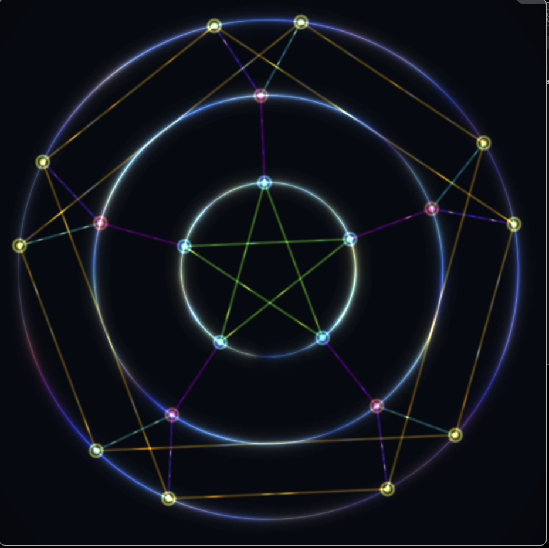
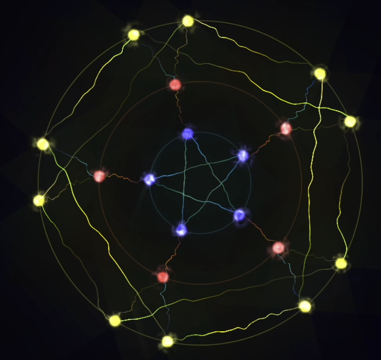

# PetersenGraph-Effects

PetersenGraph GLSL Effects

## Overview
This project provides dynamic visualizations of the Petersen Graph using GLSL shaders. It includes two main shader files:

- **PetersenGraph.glsl**: A clean mathematical visualization of the Petersen Graph based on the ChainWeb Petersen Graph specification.
- **PetersenPlasmaGraph.glsl**: A dynamic visualization combining the Petersen Graph topology with plasma visualization effects.

## Features
- Visualization of the Petersen Graph with concentric circles and connections.
- Dynamic plasma effects for enhanced visual appeal.
- Cosmic ring effects and animated connections.

## Files
- `PetersenGraph.glsl`: Implements a clean and static visualization of the Petersen Graph.
- `PetersenPlasmaGraph.glsl`: Adds dynamic plasma and flow effects to the Petersen Graph.

## Usage
To use these shaders, integrate them into your GLSL-supported rendering pipeline. Adjust parameters such as `iTime` and `iResolution` to control animation and resolution.

## Visual Previews

### PetersenGraph
- **Screenshot**: 
- **Video**: [PetersenGraph.mov](mp4/PetersenGraph.mov)

The `PetersenGraph.glsl` shader provides a clean and static visualization of the Petersen Graph. The screenshot and video demonstrate its concentric circles and connections.

### PetersenPlasmaGraph
- **Screenshot**: 
- **Video**: [PetersenPlasmaGraph.mov](mp4/PetersenPlasmaGraph.mov)

The `PetersenPlasmaGraph.glsl` shader combines the Petersen Graph topology with dynamic plasma effects. The screenshot and video showcase its animated connections and cosmic ring effects.

## License
This project is licensed under the MIT License. See the `LICENSE` file for details.
